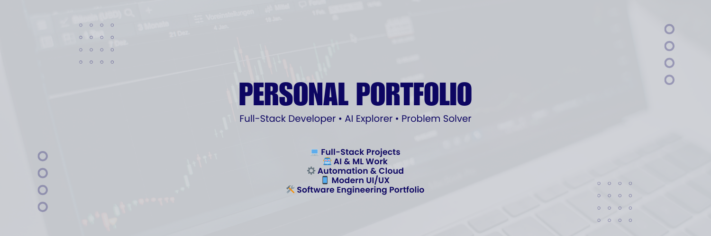

# Personal Website – Vaishali Jadon

This is my personal portfolio website, built with **Next.js**, **TypeScript**, and **Tailwind CSS**.  
It showcases my projects, experience, and contact information in a clean, responsive layout.

<p align="center">
  
</p>

## Features

- Modern, responsive UI
- Projects section with detailed cards
- About page with background and skills
- Contact form powered by Formspree
- Dark/light theme toggle

## Tech Stack

- [Next.js](https://nextjs.org/)
- [React](https://react.dev/)
- [TypeScript](https://www.typescriptlang.org/)
- [Tailwind CSS](https://tailwindcss.com/)

## Getting Started

```bash
# install dependencies
npm install

# run locally
npm run dev
# then open http://localhost:3000
